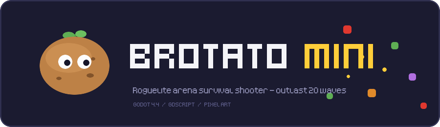
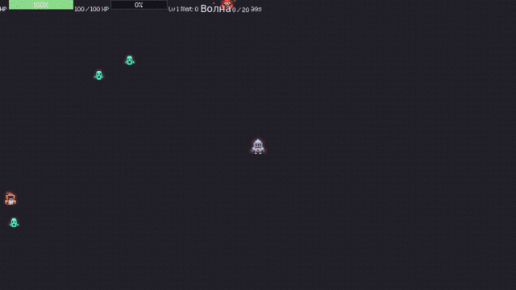
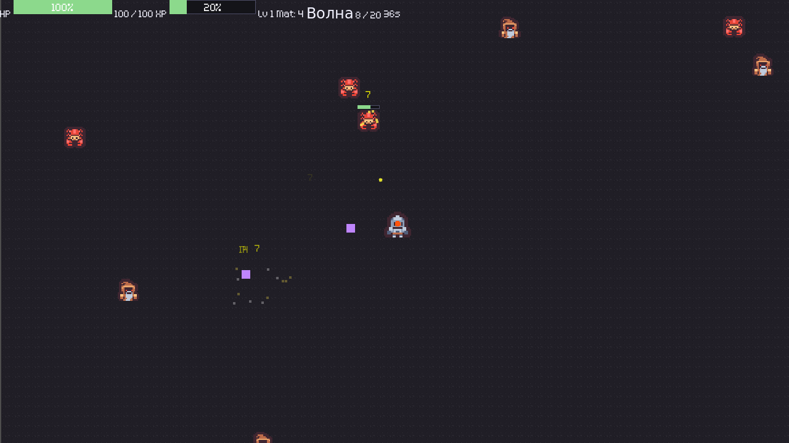
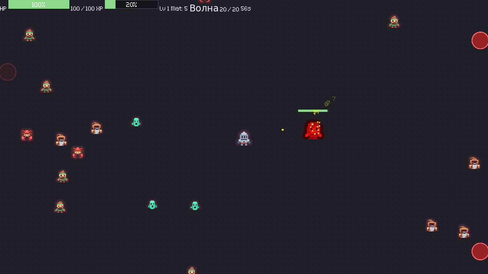
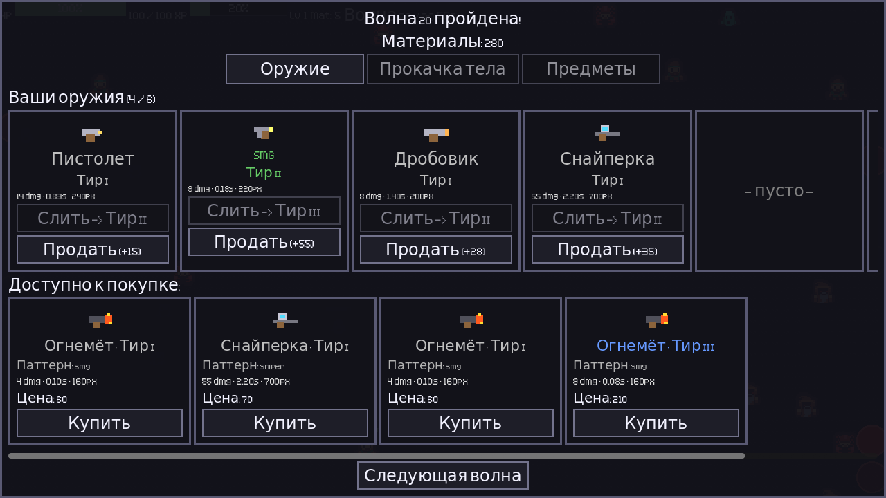
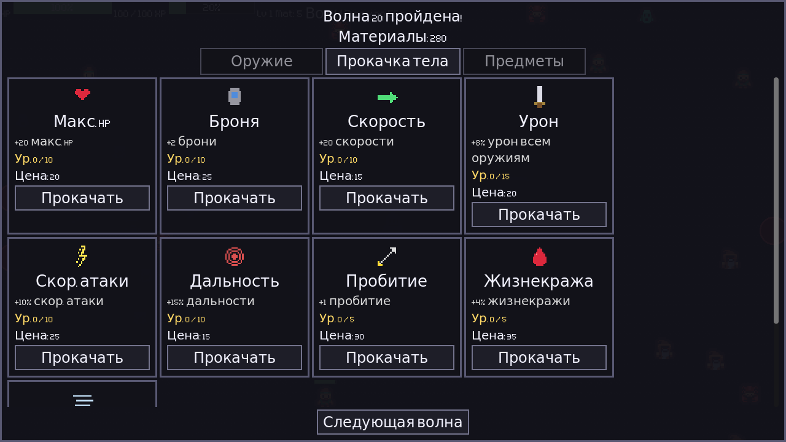

<div align="center">



[](https://godotengine.org)
[](scripts/)
[](LICENSE)


**A roguelite arena survival shooter — pick a character, stack a build, and outlast 20 waves of the horde.**

</div>

<p align="center">
  
</p>

---

## 🥔 Gameplay

You are a potato in an arena, and the horde wants you dead.

Pick one of **8 characters** on the title screen — each comes with its own stat
traits and starting weapon. Every wave is a countdown timer. Enemies stream in
from the edges and walk straight at you — you move, your weapons **fire
automatically** at the nearest target. Kills drop XP and materials. Survive the
timer and the wave ends; let your HP hit zero and it's over.

Between waves the **shop** opens: spend materials on new weapons, permanent body
upgrades and accessories, then hit *Next Wave*. Clear all **20 waves** to win.

## ✨ Features

- **8 playable characters** — All-Rounder, Tank, Rapid Gunner, Marksman, Vampire,
  Sprinter, Berserker and Lucky, each with unique stat modifiers (positive and
  negative) and a signature starting weapon.
- **20 escalating waves** — enemies get faster, tougher and more numerous every round.
- **6 weapons**, each with **4 tiers** (I–IV). Buy two of the same tier and **combine**
  them into the next — pistol, SMG, shotgun, sniper, flamer and minigun, up to 6 slots.
- **4 enemy types** — fast, light, tank and elite — plus **4 bosses** on waves 5 / 10 /
  15 / 20 with their own abilities: **dash**, **projectile spread** and **minion summon**.
- **A three-tab shop** — weapons, **9 body upgrades** (HP, armor, speed, damage, attack
  speed, range, pierce, lifesteal, dodge) and **10 accessories** with rarity tiers.
- **Leveling** — XP fills the bar, levels grant extra max HP.
- **Game feel** — screen shake, hit particles, floating damage numbers and fully
  procedural sound effects.

## 📸 Screenshots

<table>
  <tr>
    <td align="center"><br><sub>Arena combat — auto-fire at the nearest enemy</sub></td>
    <td align="center"><br><sub>Wave 20 — the final boss</sub></td>
  </tr>
  <tr>
    <td align="center"><br><sub>Shop — buy and combine weapons</sub></td>
    <td align="center"><br><sub>Shop — permanent body upgrades</sub></td>
  </tr>
</table>

## 🎮 Controls

| Key | Action |
|---|---|
| `WASD` / `Arrow keys` | Move |
| — | Shooting is automatic |
| `Esc` | Pause |

## ▶️ Run from source

The game is a plain Godot project — no build step, no dependencies.

1. Install **[Godot 4.4+](https://godotengine.org/download)** (standard build, GDScript).
2. Clone the repository:
   ```sh
   git clone https://github.com/BLXCKBXXST/brotato-mini.git
   ```
3. Open `project.godot` in Godot, or run it directly:
   ```sh
   godot --path brotato-mini
   ```
4. Press **F5** to play.

## 🗂️ Project structure

```
brotato-mini/
├── scenes/         Godot scenes (Main, Enemy, Bullet, Drop, …)
├── scripts/        GDScript game logic (~1.9k lines)
├── assets/         sprites, icons, fonts, sounds
├── themes/         UI theme
├── docs/           design document + media
└── project.godot   Godot 4.4 project file
```

A full breakdown of systems, balance and architecture lives in the
**[Game Design Document](docs/GAME_DESIGN_DOCUMENT.md)**.

## 🙌 Credits

Built with the [Godot Engine](https://godotengine.org). Entity sprites are from
Kenney's *Tiny Dungeon* pack, fonts are *Kenney Pixel* and *Kenney Mini Square*, and the
bullets, floor and shop icons are procedurally generated. All bundled assets are **CC0**
— see [assets/CREDITS.md](assets/CREDITS.md).

## 📄 License

Source code is released under the **[MIT License](LICENSE)**. Game assets are CC0
(licensed separately — see the credits above).
